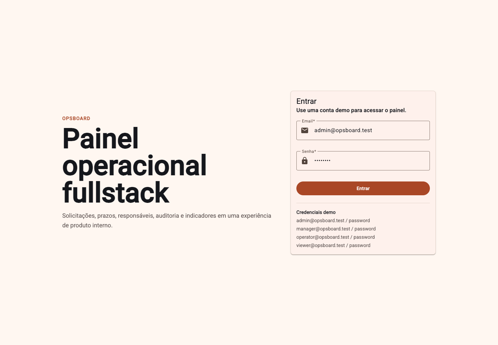
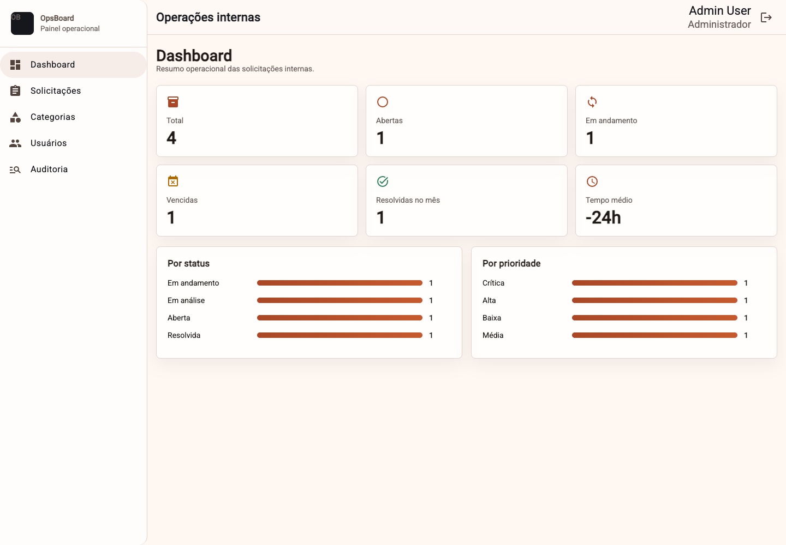
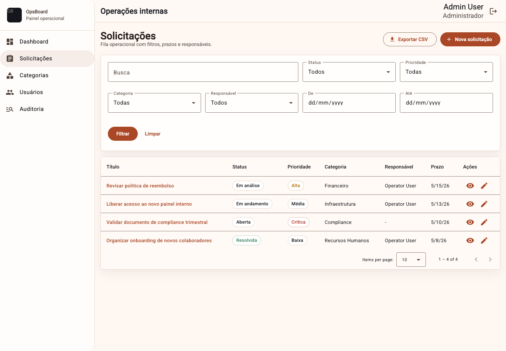
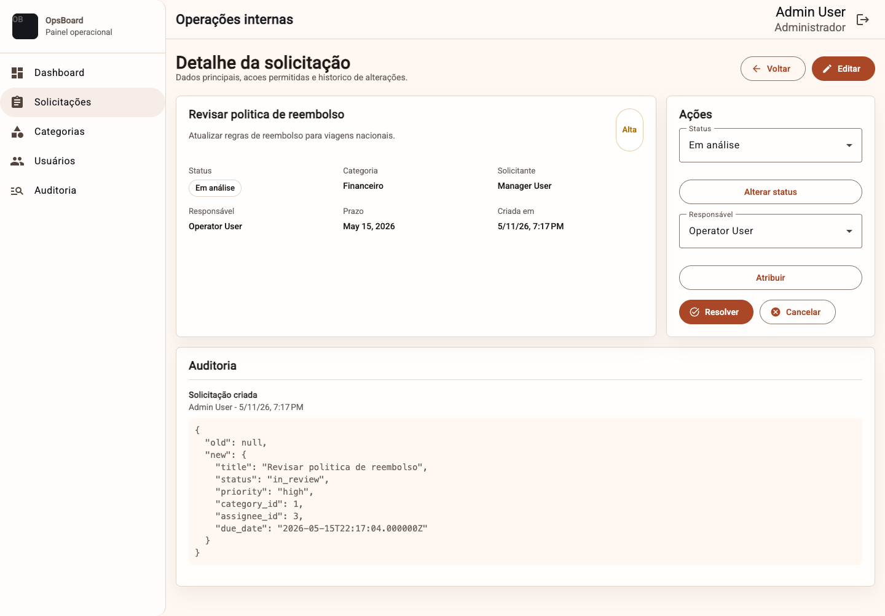
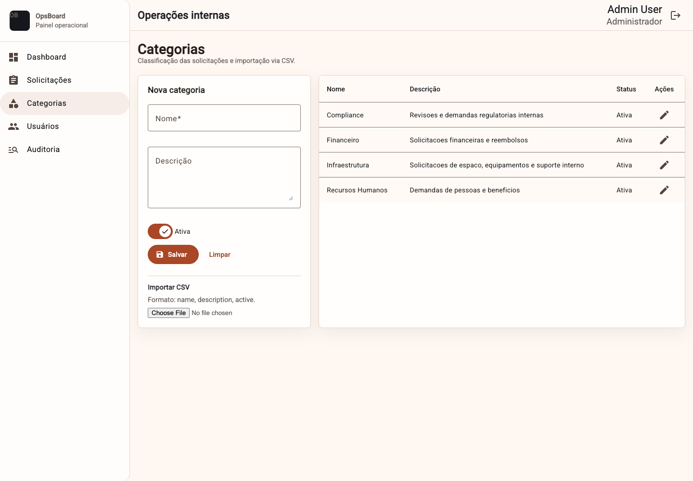
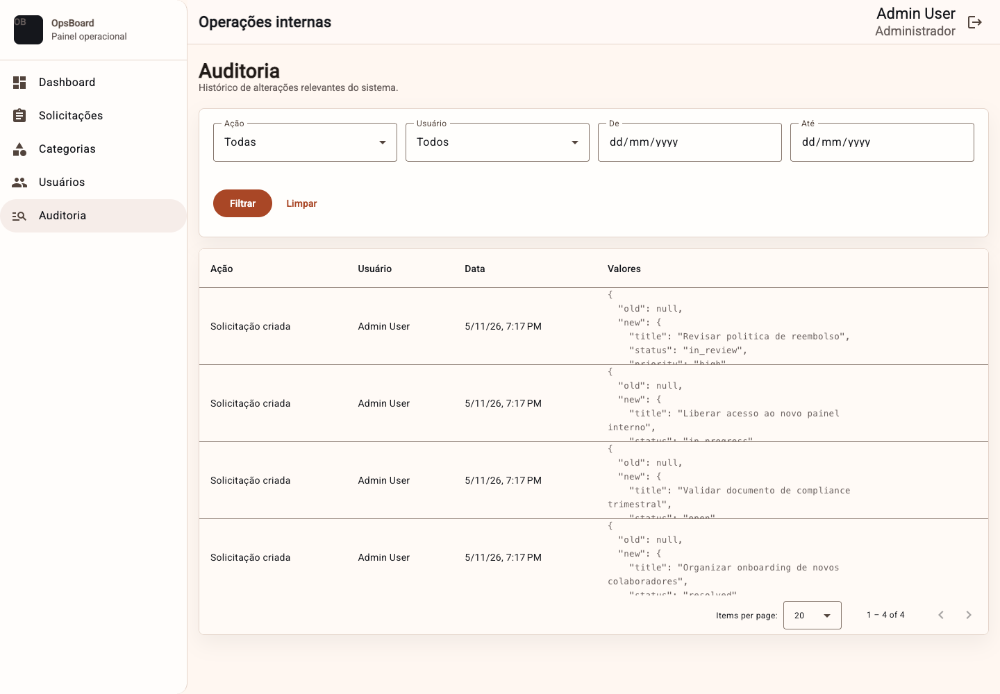

# OpsBoard — Painel Operacional Fullstack

## Visão geral

OpsBoard é uma aplicação fullstack demonstrativa para gestão de solicitações operacionais internas, criada para simular um sistema real de produto, com autenticação, dashboard, permissões, auditoria, filtros, CSV, API REST e ambiente Docker.

## Por que este projeto existe

O projeto foi criado como case de portfólio para demonstrar product engineering além de CRUD básico: domínio documentado, decisões técnicas registradas, autenticação SPA com cookies/CSRF, permissões no backend, auditoria e uma interface operacional em português.

## Funcionalidades

- Login/logout com Laravel Sanctum SPA auth.
- Dashboard com KPIs operacionais.
- CRUD de solicitações com filtros, status, prioridade, responsável e prazo.
- Resolução, cancelamento, atribuição e troca de status.
- Gestão de categorias e usuários.
- Auditoria global e por solicitação.
- Exportação CSV de solicitações.
- Importação CSV de categorias.
- API REST documentada e testes básicos.

## Stack

- Frontend: Angular 21, Angular Material 21, TypeScript, SCSS.
- Backend: Laravel 13, Sanctum, PHP 8.3+; Docker usa PHP 8.4.
- Database: PostgreSQL.
- Infra: Docker Compose.
- Workflow: documentação técnica, testes básicos e decisões arquiteturais registradas.

## Arquitetura

Monorepo simples, sem Turborepo:

```text
frontend/   Angular SPA
backend/    Laravel API
docs/       Specs, API docs, ADRs, screenshots e auditoria final
docker/     Dockerfiles e apoio local
```

## Screenshots

Screenshots reais capturados a partir do stack local com dados seed:

| Login | Dashboard |
| --- | --- |
|  |  |

| Solicitações | Detalhe |
| --- | --- |
|  |  |

| Categorias | Auditoria |
| --- | --- |
|  |  |

## Como rodar localmente

Pré-requisitos:

- Docker 29+
- Node 22+
- npm 11+ para desenvolvimento local do frontend
- PHP 8.3+ para desenvolvimento local do backend; o Dockerfile usa PHP 8.4
- Composer 2.8+

Com Docker:

```bash
cp .env.example .env
cp backend/.env.example backend/.env
docker compose run --rm backend sh -c "composer install && php artisan key:generate"
docker compose up -d --build
docker compose exec backend php artisan migrate:fresh --seed
```

URLs:

- Frontend: `http://localhost:4200`
- Backend: `http://localhost:8000`
- Healthcheck: `http://localhost:8000/api/health`

Se `8000` ou `4200` já estiverem ocupadas, use portas alternativas pareadas:

```bash
BACKEND_PORT=8001 FRONTEND_PORT=4201 POSTGRES_PORT=5433 docker compose up -d --build
```

Sem Docker, para desenvolvimento rápido:

```bash
cd backend
composer install
php artisan migrate:fresh --seed
php artisan serve --host=0.0.0.0 --port=8000
```

```bash
cd frontend
npm install
npm start
```

## Credenciais demo

Todas usam a senha `password`.

- `admin@opsboard.test`
- `manager@opsboard.test`
- `operator@opsboard.test`
- `viewer@opsboard.test`

## Documentação

- Produto e domínio: `docs/specs/`
- API: `docs/api/backend-endpoints.md`
- Decisões técnicas: `docs/decisions/`
- Prompts preservados: `docs/prompts/`
- Screenshots reais: `docs/screenshots/`

## Decisões técnicas

- Monorepo simples para leitura direta e baixa complexidade.
- PostgreSQL para modelagem relacional e aderência a sistemas internos.
- Sanctum SPA auth para evitar tokens no `localStorage`.
- Angular Material MD3 para UI consistente sem criar design system do zero.
- Auditoria própria para demonstrar rastreabilidade sem pacote externo.

## Testes

Backend:

```bash
cd backend
php artisan test
```

Frontend:

```bash
cd frontend
npm run build
npm run test
```

## Status do projeto

Implementação funcional de portfólio em desenvolvimento. O projeto já cobre autenticação, domínio principal, permissões, auditoria, CSV, frontend operacional, Docker local, documentação técnica e screenshots reais.

## Próximos passos

- Adicionar testes E2E leves.
- Melhorar acessibilidade com revisão manual de teclado/leitores.
- Adicionar licença se o repositório for publicado.

## GitHub topics sugeridos

`angular`, `laravel`, `postgresql`, `docker`, `sanctum`, `fullstack`, `operational-dashboard`, `portfolio-project`

## Texto para portfólio

**OpsBoard — Painel operacional fullstack**

Sistema demonstrativo para gestão de solicitações internas, com autenticação, dashboard de KPIs, permissões por papel, auditoria de alterações, filtros avançados, import/export CSV, API REST documentada e ambiente Docker.

Atuação: concepção de produto, arquitetura fullstack, implementação, documentação técnica e decisões orientadas à manutenção real.

Stack: Angular / Laravel / PostgreSQL / Docker.
